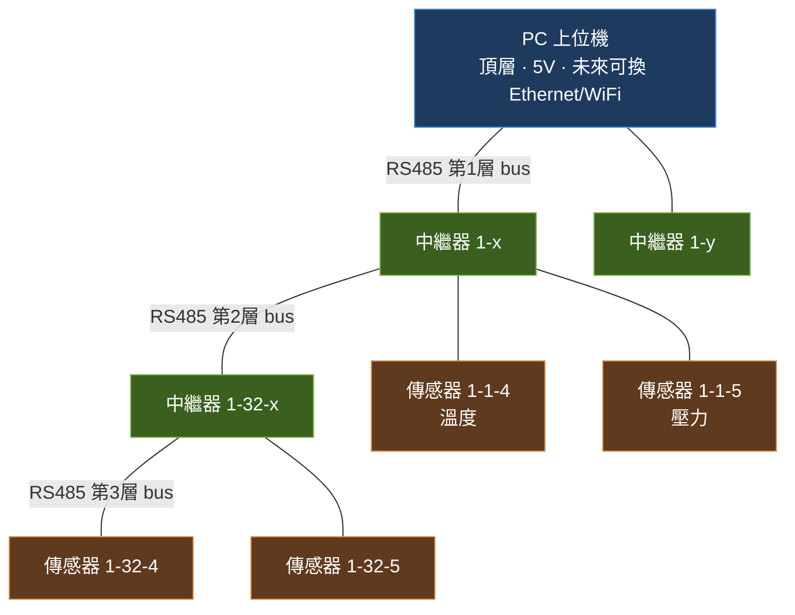
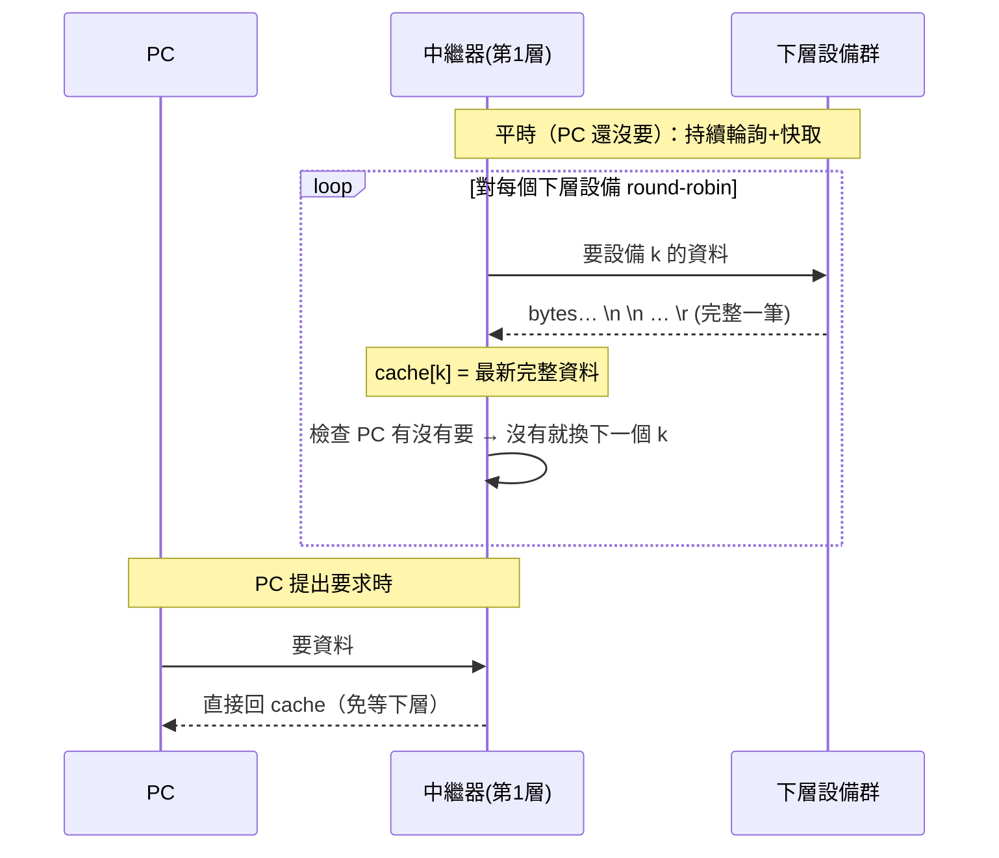

# 01 · 系統架構

## 1. 拓樸：RS485 bus 的樹狀堆疊

整個系統是**多段 RS485 bus 疊成的樹**。每一「層」其實是一條獨立的 RS485 multidrop bus；一台中繼器把「上一層的一條 bus」和「自己下一層的一條 bus」橋接起來。



- 一條 bus（一層裡的一個 master 底下）**最多 64 台**設備（受 6 位元指撥定址限制，見 [03](03_定址與指撥開關.md)）。
- 一台中繼器底下掛的，可以是**更下層的中繼器**、也可以是**末端傳感器**，混掛沒問題。
- 樹可以繼續往下長；層數靠字串位址表達，不會有「陣列開多大」的上限問題。

## 2. 兩種角色

| 角色 | 硬體/語言 | 對上層 | 對下層 |
|------|-----------|--------|--------|
| **末端傳感器模組（葉節點）** | Arduino / C++ | 是 slave：被輪詢才回話，回自己的位址+量測值 | 無 |
| **中繼器（分支節點）** | MicroPython / ESP32 | 是 slave：被上層要求才把 cache 回上去 | 是 master：主動輪詢自己這條 bus 上的孩子 |
| **PC（根）** | Python | — | 是 master：對第 1 層中繼器要資料 |

> 關鍵心智模型：**中繼器 = 上層看它是「一個 slave」，下層看它是「一個 master」**。它兩個 UART：一個接上層 bus、一個接下層 bus（見 [02](02_通訊協定.md)）。

## 3. 資料流：下層一直跑、上層要才給（cache 樹）

因為是 RS485，**上層不主動推、只有下層被要求才回**。為了不讓 PC 的讀取速度拖垮整棵樹，每台中繼器**不等上層**，自己一直輪詢下層並把**最新一筆完整資料**暫存起來（cache）。上層一要，立刻把 cache 給出去。



- **cache 內容**：每台中繼器維護一個 `dict`，key = 下層設備的本地位址，value = 該設備最近一筆以 `\r` 收完的完整資料（含時間戳/新鮮度）。
- **新鮮度 / 逾時**：輪詢某設備若在等 `\r` 時逾時，就標記該筆為 stale 並跳過，換下一個（見 [02 §4](02_通訊協定.md)）。
- **越往下、cache 越即時**；越往上、彙整越多。PC 端拿到的是「一次要、就有一批現成資料」。

## 4. 位址如何被拼出來（逐跳前綴）

每台設備**只知道自己的本地位址**（指撥設定，0–63）。完整路徑 `1-32-4` 是資料**往上流時逐跳拼出來**的：每經過一台中繼器，就把自己的本地位址前綴上去。

```
末端(本地=4)  回 "4 + 資料"
   ↑ 經過中繼器(本地=32)  → "32-4 + 資料"
      ↑ 經過中繼器(本地=1) → "1-32-4 + 資料"
         ↑ 到 PC：看到完整路徑 1-32-4
```

好處：新增層/設備不需要重配全域位址表；一台設備搬到不同分支，路徑自動跟著變（它自己不用知道全域位址）。詳見 [03 §3](03_定址與指撥開關.md)。

## 5. 傳輸層會是瓶頸的地方（未來擴充）

當層數與每層數量變多，**瓶頸在「PC 端接收速度受 RS485 限制」**，大量資料會排隊。預留擴充：

- **頂層鏈路**（PC ↔ 第 1 層）改用 **Ethernet / WiFi**，把「樹內用 RS485、對 PC 用網路」分開。
- 因此頂層中繼器要能同時當「下層 RS485 master」＋「對 PC 的網路節點」。這在模組拆分裡是獨立的 **模組 F 傳輸層抽象**（見 [04](04_軟體模組拆分.md)）。

## 6. 為什麼用指撥開關（可熱替換）

所有設備都靠指撥定址、JSON 又可預載進中繼器，所以**維修/量產時可直接換機**：新中繼器預先載好所有已知 JSON、把指撥撥成和舊機一樣的位址，插上去就接手，不必改上層設定。這是整個定址設計的實務動機。
