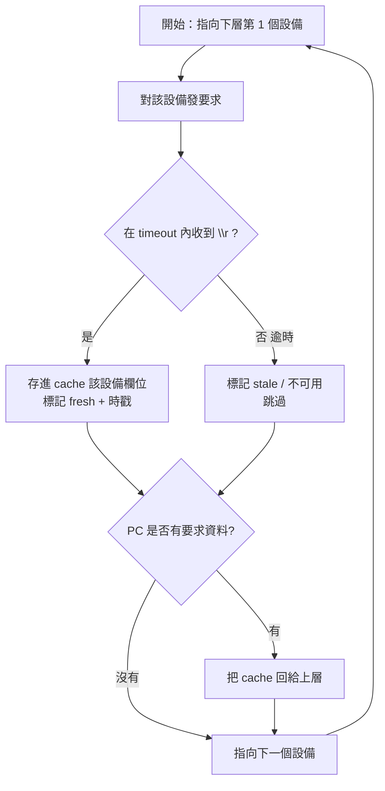

# 02 · 通訊協定

本文件是**各模組共用的契約**。建議先凍結此文件，再讓末端(Arduino)、中繼器(MicroPython)、PC(Python) 分頭實作。

## 1. 實體層

- **匯流排**：RS485 半雙工 2 線差動（A/B），multidrop，一條 bus 一個 master（該層中繼器）＋最多 64 slave。
- **收發器**：MAX13487（AutoDirection，收發方向自動切換，**免 DE/RE GPIO**）。對 master 免對齊「TX 完成→放開匯流排」時序，對 slave 省一支腳。
- **Baud**：起步建議 **115200 8N1**（先求穩，之後量測後再往上調）。同一 bus 全節點同 baud。
- **偏壓/終端**：bus 兩端各一顆 120Ω 終端電阻；至少一處加 failsafe 偏壓（上拉 A、下拉 B），避免閒置時浮動被誤讀。

## 2. 框架：byte 串流 + `\n` 未完 / `\r` 完成

資料以 **byte 為單位**串流。傳送端：

- 這段資料**還沒送完** → 該段結尾送 `\n`（0x0A）＝「還有，繼續等」。
- 整筆資料**送完了** → 結尾送 `\r`（0x0D）＝「這筆完整結束」。

接收端邏輯（**per-record emit，定版**：每遇 `\n`/`\r` 就吐出「一筆」記錄，並帶 `final` 旗標）：

```
buf = []
while True:
    b = read_byte()              # 逐 byte
    if b == '\n':                # 一筆完整、批次未完
        deliver(buf, final=False)   # 交出這一筆，後面還有
        buf = []
        continue
    if b == '\r':                # 一筆完整、批次結束
        deliver(buf, final=True)    # 交出最後一筆，這批收工
        buf = []
        return
    buf += b
```

> 白話：`\n` = 「這**一筆**完整了，但後面還有」；`\r` = 「這一筆完整了，而且整批到此為止」。
> 每一段（`\n` 或 `\r` 結尾）都是**一筆獨立記錄**——單筆回報就是一筆 `\r`；中繼器一次回一批孩子，就是多筆 `\n` + 最後一筆 `\r`（見 §3 末註）。此語意由 [共用協定庫 lib/](../lib/README.md) 的 `FrameDecoder` 保證，C++/Python 一致。

### 2.1 重要限制：payload 不能含裸 `\n` / `\r`

因為 `\n`/`\r` 被當成框架控制字元，**傳輸內容本身不可出現裸的 0x0A/0x0D**。做法：

- **JSON 一律單行（minified）**，不要 pretty-print。
- 若欄位值可能含換行，先做逃逸（`\\n`）或 base64。

（若日後 payload 必須含二進位，`\n`/`\r` 框架就不夠用，需改成「長度前綴」或 byte-stuffing——見 [06 設計決策](06_設計決策與待確認.md)。）

## 3. 傳輸內容格式（一筆完整資料）

一筆以 `\r` 收完的完整資料 = **完整分層位址 + 末端傳感器資訊**。建議格式：

```
<full-address>|<minified-json>\r
```

範例（單行）：

```
1-32-4|{"t":"TMP","v":26.7,"u":"C","ts":1723100000,"ok":1}\r
```

- `full-address`：字串路徑，如 `1-32-4`（逐跳前綴拼出，見 [03 §3](03_定址與指撥開關.md)）。
- `json`：該末端的量測 payload（型別、值、單位、時戳、狀態）。schema 見 [schema/](../schema)。

> 分段（未完 `\n`）可以用在「一台中繼器要一次回一批孩子」時：每個孩子一行以 `\n` 結尾，最後一行以 `\r` 收尾，代表這批回完。

### 3.1 編碼定案（2026-09）：DESC=JSON / REQ=純值 CSV + CRC

上面的 `<addr>|<minified-json>` 是**原型期**用法（傳輸也走 JSON，verbose 且中繼器根本不解析）。定案改為**分場合編碼**：

| 訊息 | 編碼 | 頻率 | 內容 |
|---|---|---|---|
| **DESC** | **JSON**（自描述） | 偶爾（開機自報 / PC 建索引） | node 身分 + `peripherals[]` 說明書 |
| **REQ** | **純值 CSV**（descriptor 定順序） | 每輪 | 只送會變的值；型別/單位/順序由 descriptor 提供 |
| 極限頻寬 | binary（長度前綴框架） | 上千台+高速才用 | 最小但不可讀、需 byte-stuffing |

**純值 CSV 範例**（node 的 3 外設值 + ok + up + CRC）：
```
1-2-3-7|25.1,3.2,1013,1,123*A3F1\r
```

- **CRC-16/MODBUS**：payload 後接 `*<hex>`（RS485 工業標準）。收到先驗，**驗不過丟棄該筆 → 逾時 → stale**（沿用既有容錯）。**逐跳重算**（中繼器前綴位址後，用新 payload 重算）。啟用只動協定庫（`protocol.py` + `protocol.h/.cpp` 實作 `crc16()`、設 `CRC_ENABLED=True`，以 `test_vectors.json` 對齊）。
- **`age` + 健康 envelope(`ok`/`up`/`rst`) 放框架外**（不塞進 payload）→ **中繼器純轉發、不碰 payload**（編碼對它透明）→ 順帶修掉「age 每跳疊一次」的問題。
- **指標式組裝**：末端按 descriptor 順序**指向各外設值槽**串出 CSV，免中間 JSON 物件（見 [09 §4](09_軟體架構定案.md)）。
- 詳細軟體架構定案見 [09](09_軟體架構定案.md)。

## 4. 輪詢時序與逾時（中繼器行為）

以第 1 層中繼器為例（[需求 14、15]）：



要點：

1. **round-robin**：問完一個孩子（收到 `\r` 或逾時），就回頭看上層有沒有要，再問下一個。
2. **逾時就跳過**：等 `\r` 期間逾時 → 不卡住，標記該孩子 stale，換下一個。逾時值建議可調（依 baud 與最大 payload 估）。
3. **上層要求優先權**：上層一要，優先回 cache，不必等當前輪詢跑完一圈。

## 5. 請求 / 回應方向

- **PC → 第1層中繼器**：要資料（可「要全部 cache」或「要指定位址」）。
- **中繼器 → 下層**：主動輪詢（master）。
- **下層 → 中繼器**：被問才回（slave）。
- 中繼器對上層也是 slave：**平時不主動推**，被要求才回 cache。

## 6. 進階（編輯）模式

當設備指撥的**功能位撥到 OFF（進階/編輯）**時（見 [03 §2](03_定址與指撥開關.md)），該設備進入設定模式，接受寫入（例如燒錄/更新它的 JSON、設定參數）。常規（ON）時只做「向下讀取/回報」。編輯模式的指令集另訂（建議：`CFG|<addr>|<json>\r`），先在 [06](06_設計決策與待確認.md) 佔位。

## 7. 待確認事項（彙整於 06）

- 位址 0 是否保留為廣播 / 未設定。→ ✅ 已定：保留 0 當廣播。
- `\n`/`\r` 框架 vs 長度前綴（若未來要傳二進位）。→ 純值 CSV 沿用 `\n/\r`；binary 才需長度前綴（見 §3.1）。
- 是否需要 CRC/checksum。→ ✅ **已定：加 CRC-16/MODBUS**（見 §3.1）。
- 上層「要指定位址」的請求語法。→ `REQ|<addr|ALL>`；動詞 DESC/REQ/SET 見 [09](09_軟體架構定案.md)。
