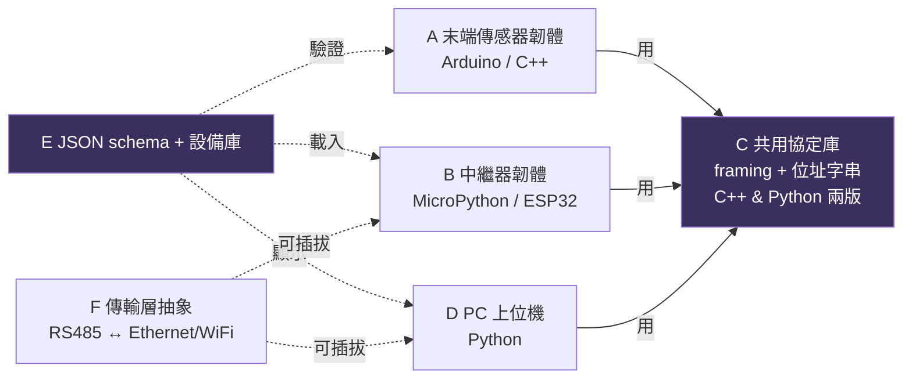
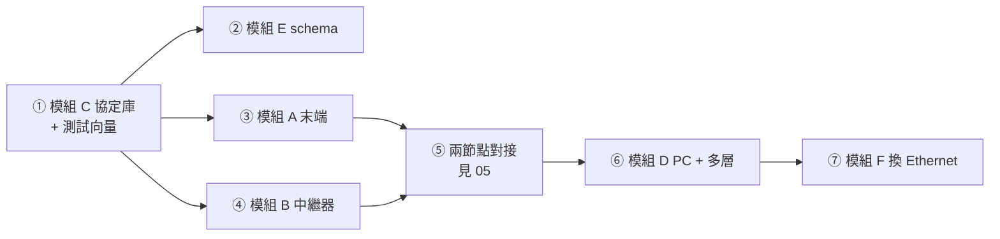

# 04 · 軟體模組拆分（分頭開發）

目標：把系統切成**可獨立、可平行開發**的模組，彼此只靠[通訊協定 02](02_通訊協定.md) 與 [JSON schema](../schema) 這兩份「契約」對接。**先凍結契約，再分頭做。**

## 模組總覽

## 各模組規格

### 模組 C — 共用協定庫（**最先做，是契約**）
- **內容**：`\n`/`\r` 框架的**編碼/解碼**、位址字串操作（前綴、切段、驗證）、（可選）CRC。
- **兩份實作**（行為必須一致）：
  - `protocol.h/.cpp`（C++，給模組 A）
  - `protocol.py`（Python，給模組 B 的 MicroPython 與模組 D 的 CPython 共用）
- **交付**：一組跨語言一致的單元測試向量（同一輸入 → 同一輸出），確保三邊實作對得上。
- **負責人**：定義協定的人；其他模組等這個先定版。

### 模組 A — 末端傳感器韌體（Arduino / C++）
- **平台**：Arduino UNO / ESP32（當末端時）。
- **職責（單純驅動 + 傳輸）**：
  1. 讀 7 階指撥（6 位址 + 1 功能）。
  2. 讀感測器（溫度/壓力…），組 minified JSON payload。
  3. 用模組 C 打包：`<本地位址>|<json>\r`，被輪詢才回。
  4. 功能位 OFF 時進編輯模式，接受寫入自有 JSON/參數。
- **不做**：不輪詢、不 cache、不拼全路徑（那是中繼器的事）。
- **骨架**：[../firmware/terminal_arduino/](../firmware/terminal_arduino)

### 模組 B — 中繼器韌體（MicroPython / ESP32）
- **平台**：ESP32（MicroPython，善用 `dict`/`list`）。
- **職責**：
  1. **雙 UART**：上層 bus（slave 角色）+ 下層 bus（master 角色）。
  2. **輪詢迴圈**：round-robin 問下層每個孩子，收 `\r` 存 cache、逾時跳過。
  3. **cache**：`dict{本地位址: (最新完整資料, 時戳, fresh/stale)}`。
  4. **前綴**：把孩子資料前綴自己的本地位址，向上拼路徑。
  5. **上層要求優先**：被上層要就回 cache。
  6. **JSON 庫**：載入所有已知設備 JSON 以辨識下層。
- **骨架**：[../firmware/repeater_micropython/](../firmware/repeater_micropython)

### 模組 D — PC 上位機（Python）
- **職責**：
  1. 連線（序列埠；未來走模組 F 換 Ethernet/WiFi）。
  2. **請求排程**：向第 1 層中繼器要資料（全部 / 指定位址）。
  3. 解析框架 → 更新設備即時值表。
  4. **設備資料庫**：用 JSON schema 呈現/驗證各設備。
  5. **即時儀表板**：即時數值、樹狀拓樸、新鮮度。
  6. **規則引擎**（[需求 17]）：使用者設條件（如溫度>X 觸發輸出）→ 自動控制輸出。
  7. Log / 匯出。
- **骨架**：[../pc/](../pc)

### 模組 E — JSON schema + 設備庫
- **內容**：設備 JSON 的 schema、各型別範例、驗證工具。
- **交付**：`device.schema.json` + 每種傳感器一個範例 + 驗證腳本。
- **骨架**：[../schema/](../schema)

### 模組 F — 傳輸層抽象（擴充，之後做）
- **動機**（[需求 11]）：層數/數量變多時 PC 端 RS485 接收會塞車 → 頂層鏈路改 Ethernet/WiFi。
- **內容**：定義 `Link` 介面（`send_bytes` / `recv_bytes`），提供 `RS485Link` 與 `EthernetLink`/`WiFiLink` 兩實作；模組 B（頂層中繼器）與模組 D 只依賴介面，不綁死實體層。

## 建議開發順序

1. **先定 C（協定）+ E（schema）** — 這是所有人共用的契約，先凍結。
2. A / B 可同時開工（都依 C）。
3. 先做 **A↔B 兩節點對接**（[05 測試 Stage 0](05_測試架構建議.md)）驗證框架與定址。
4. 再上 **D（PC）+ 多層樹**。
5. 最後 **F（Ethernet/WiFi）** 解 PC 端瓶頸。

## 分工建議（若多人）

| 人 | 模組 | 前置依賴 |
|----|------|----------|
| 韌體 A | A 末端(Arduino) + C 的 C++ 版 | 協定定版 |
| 韌體 B | B 中繼器(MicroPython) + C 的 Python 版 | 協定定版 |
| 上位機 | D PC + 規則引擎 | 協定定版、schema |
| 資料/系統 | E schema + F 傳輸層 | — |
