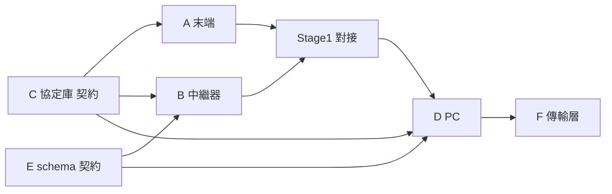

# 子專案拆分總覽

把 RS485_C 拆成可**分對話平行開發**的子專案。每個子專案一份 kickoff brief（本資料夾），
裡面有「**貼到新對話的開場白**」——新對話冷啟動時貼那段就能接上完整脈絡。

## 運作方式

- **單一 repo（mono-repo）**：https://github.com/PeiaLo/RS485C ，本機 `C:\Users\apial\Desktop\RS485_C`。
- 每個子專案 = repo 裡一個資料夾，**用各自的對話開發**，都 push 回同一個 repo。
- **共用契約**＝[docs/02 通訊協定](../docs/02_通訊協定.md) 與 [schema/](../schema)。任何模組**不可自行改契約**；要改先回「契約對話（C/E）」統一改，再讓大家 pull。
- 新對話開發流程：`git pull` → 改自己的資料夾 → commit → `git push`。其他對話 pull 就同步。

## 拆分地圖

| 子專案 | 資料夾 | 語言/平台 | 依賴 | 建議順序 | 狀態 |
|--------|--------|-----------|------|----------|------|
| [C 協定庫](C_協定庫.md) | `lib/` | C++ & Python | — | **①先做（契約）** | 雛形嵌在 Stage0，待抽出+測試向量 |
| [E JSON schema](E_schema.md) | `schema/` | JSON | — | **①先做（契約）** | schema+2範例已建，待驗證腳本 |
| [A 末端韌體](A_末端韌體.md) | `firmware/terminal_arduino/` | Arduino/C++ | C | ② | Stage0 雛形可跑(假值) |
| [B 中繼器韌體](B_中繼器韌體.md) | `firmware/repeater_micropython/` | MicroPython/ESP32 | C, E | ② | 只有 Stage0 Arduino 版 master |
| [D PC 上位機](D_PC上位機.md) | `pc/` | Python | C, E | ③ | 只有骨架 README |
| [F 傳輸層](F_傳輸層.md) | `pc/`, `firmware/` | Python/ESP32 | B, D | ④ 擴充 | 只有概念 |

## 依賴與順序

**建議的開對話節奏**：

1. **先開「契約對話」**：一次把 C（協定庫）+ E（schema）定版凍結。這是其他所有模組的地基。
2. 契約定版後，**A、B、D 可以三個對話平行跑**（各依賴契約，彼此不擋）。
3. 先讓 **A + B 做 Stage 1 對接**（一台中繼器接多末端），再上 **D（PC）**。
4. **F（傳輸層/WiFi）** 最後，等真的遇到頻寬或跨棟需求。

## 每個子專案 brief 的固定結構

目標 → 範圍(做/不做) → 依賴契約 → 介面 → 交付物 → 完成定義(DoD) → 目前狀態 → **📋 開新對話貼這段**。

> 提醒：所有子專案共用同一套 `\n`/`\r` 框架、`<完整位址>|<單行json>` 格式、7 階指撥定址。這些的唯一真相在 [docs/02](../docs/02_通訊協定.md) 與 [docs/03](../docs/03_定址與指撥開關.md)。
